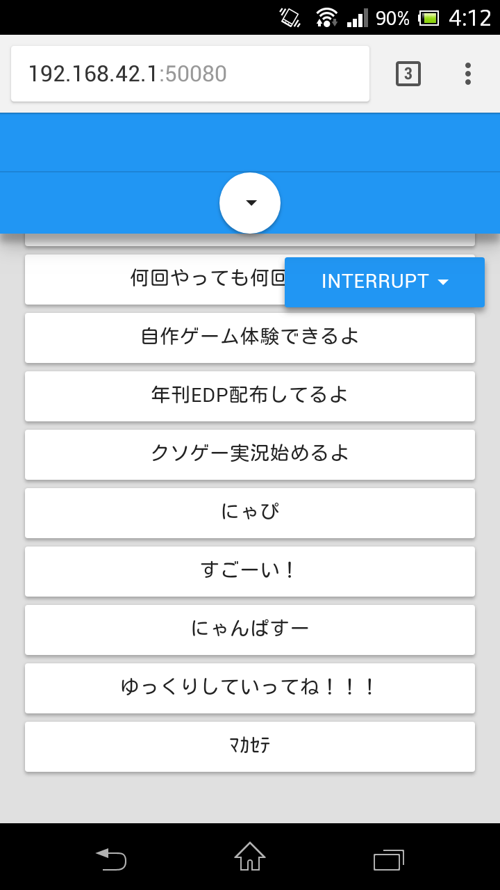

# uketsuke

| モニターのスクリーンショット | スマホのスクリーンショット | 実際の写真 |
|:---:|:---:|:---:|
|  |  |  |

## 概要
* 催し物の受付として作ったブラウザアプリ  
* スマホから操作することで，モニターに映ったキャラクターにいろいろなことをしゃべらせることができる  
* ブラウザアプリなので，催し物を見に来てくれた人でも簡単に操作することができる  
* 複数人で同時接続可能  
* サーバーにはアクセスポイント化したRaspberry Piを使用することを想定しているが，ほかのPCでも動作可能

## クライアント（スマホ）操作手順
1. ラズパイのアクセスポイントに接続
1. ブラウザを開き，専用のWebページにアクセス
1. セリフのボタンを押すとモニターに映っているゆっくりがしゃべる

## 依存パッケージ
* express
* socket.io
* ejs

## ゆっくりの画像について
使用したゆっくりの画像はライセンスの都合によりソースに含んでいません  
使用した画像は[こちら](http://www.nicotalk.com/charasozai_yk.html)の「ゆっくり霊夢改」です
